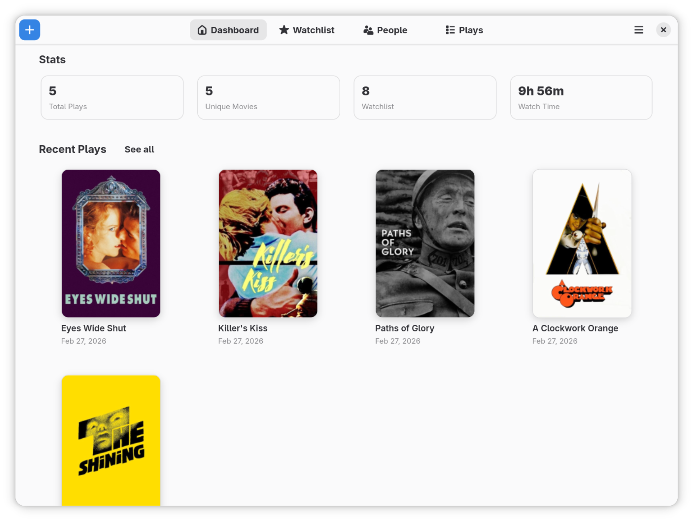
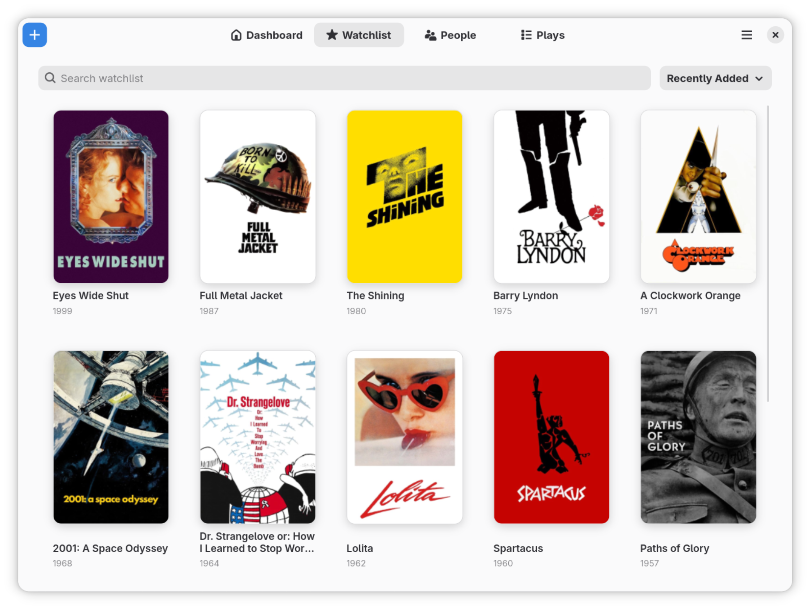
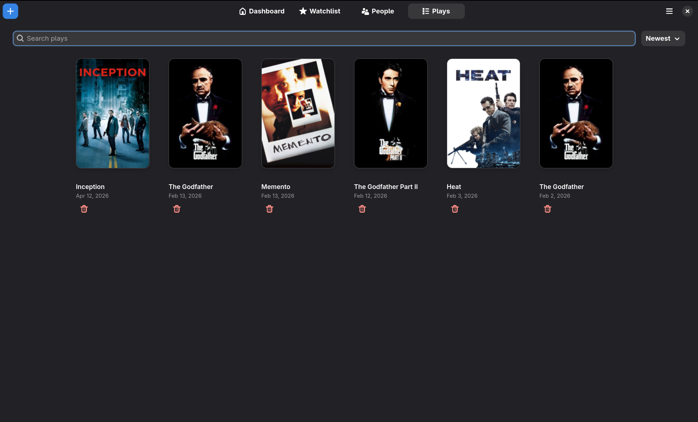
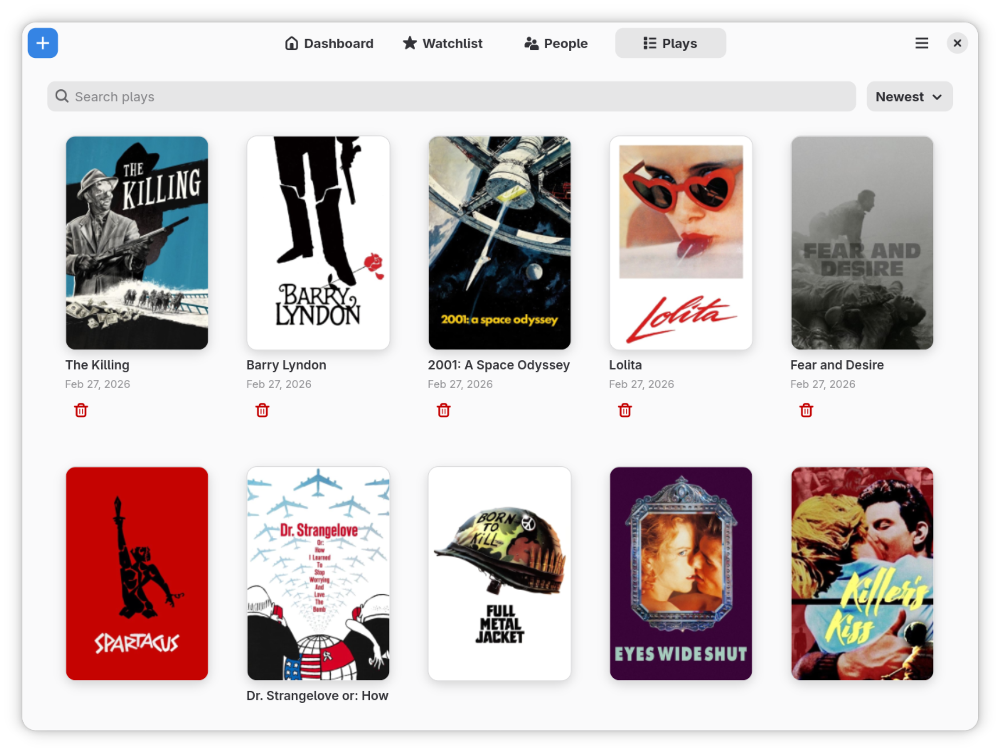
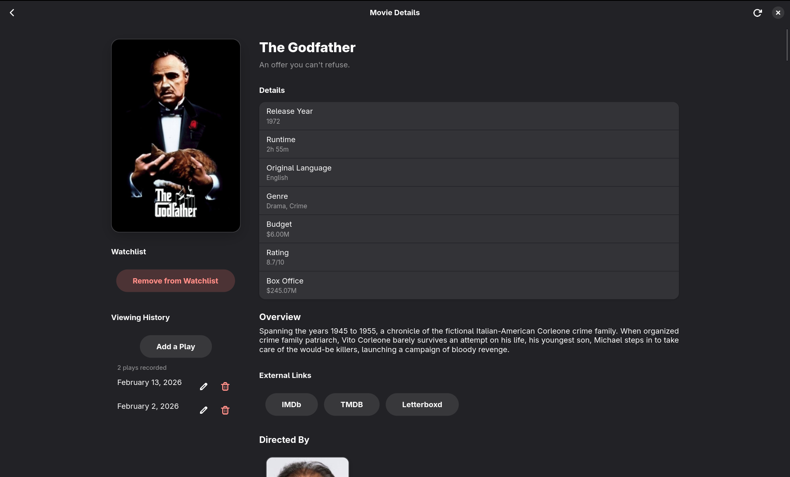
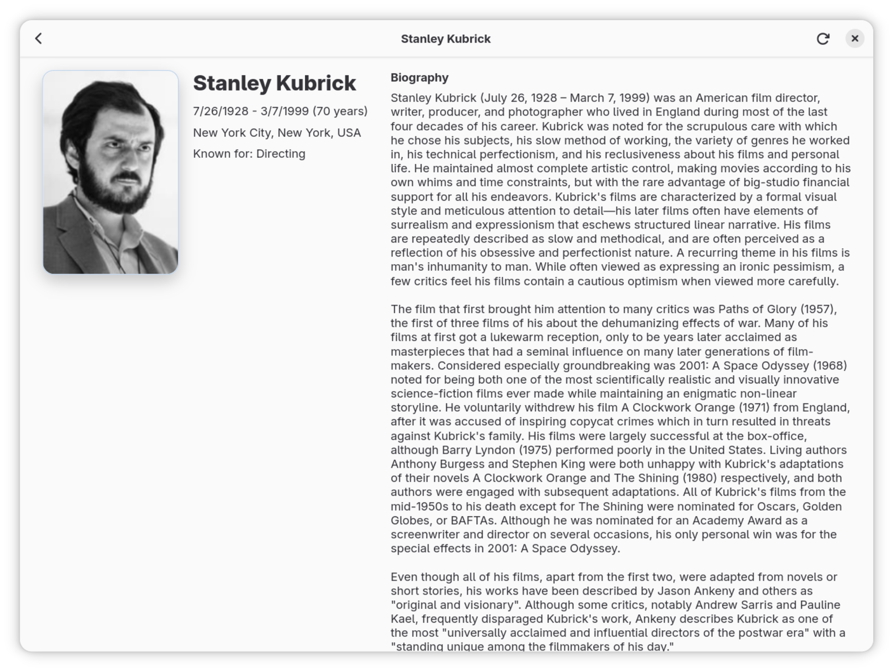

# Memento

Memento is a GNOME desktop app for tracking the movies you watch.
You can search movies from TMDB, keep a watchlist, log plays, and view personal stats.

## Features

- Movie search powered by TMDB
- Watchlist with search and sorting options
- Play history with search, sorting and sorting options
- Dashboard with totals, recent activity, and top people (directors/cast)
- Movie detail pages with credits and play logging
- Person pages with appearance stats
- Places management (cinema/home/custom places)
- Preferences for TMDB API key, auto-remove from watchlist, and full metadata refresh

## How To Use

1. Launch Memento.
2. Open `Menu -> Preferences`.
3. Add your TMDB API key (free from [themoviedb.org](https://www.themoviedb.org/)).
4. Click the `+` button to search and add movies.
5. Add movies to your watchlist and record plays when you watch them.
6. Use the `Dashboard`, `Watchlist`, `People`, and `Plays` tabs to browse your data.
7. Optional: use `Menu -> Places` to manage where you watched movies.

## Screenshots








## Build And Run

Prerequisites:

- `flatpak`
- `flatpak-builder`
- GNOME Platform/Sdk `49`

### Install From Releases

1. Download the latest `.flatpak` asset from [GitHub Releases](https://github.com/ans-ibrahim/Memento/releases).
2. Install it:

```bash
flatpak install --user ./io.github.ans_ibrahim.Memento.flatpak
```

3. Run it:

```bash
flatpak run io.github.ans_ibrahim.Memento
```

### Build Locally With Flatpak

```bash
flatpak remote-add --if-not-exists flathub https://flathub.org/repo/flathub.flatpakrepo
flatpak install flathub org.gnome.Platform//49 org.gnome.Sdk//49
```

Build and install:

```bash
flatpak-builder --user --install --force-clean build-dir io.github.ans_ibrahim.Memento.json
```

Run:

```bash
flatpak run io.github.ans_ibrahim.Memento
```

## Credits

Some of the features are borrowed from [Movary](https://github.com/leepeuker/movary).

## License

GPL-3.0-or-later. See `COPYING`.
